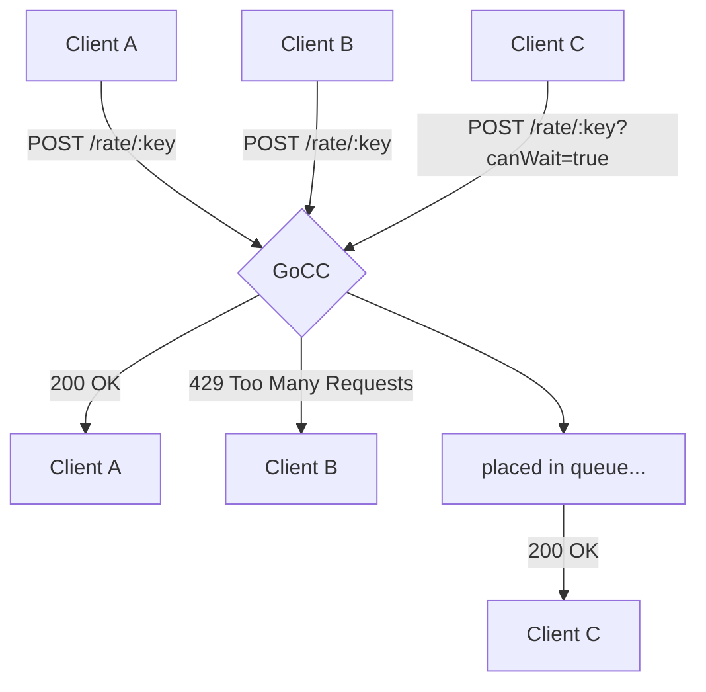
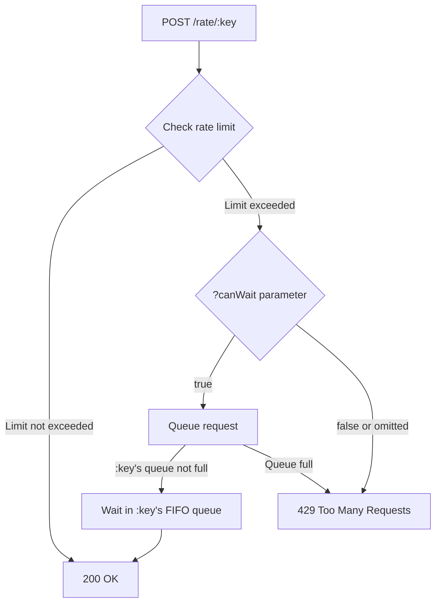
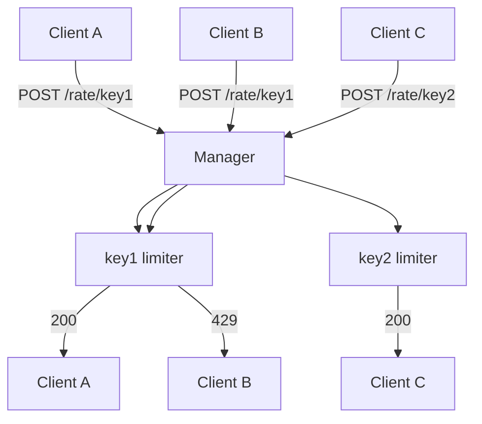

# GoCC

An in-memory, stand-alone rate limiter with a fixed time window, implemented in Go.
Originally written during a hack event at Kivra, and later decided to be open sourced.

Deployable as a stand-alone application, locally or in a cloud environment (e.g. Kubernetes). Other applications can
then query it to check if they are allowed to perform an operation, or if they should wait in a queue.



When it receives a request, it checks if the rate limit for the key is exceeded. It does this by slicing time into
windows, and counting the number of requests in each window. If the rate limit is exceeded, it returns a 429 status
code, or waits in a FIFO queue if the `canWait` query parameter is set to `true`. There is also a limit on the number
of requests that can be queued up after the window is full. See below for full API documentation.



This Readme was mostly written by LLMs :).

## Usage

To start it with default settings:

```
gopher-cruise-control
```

### Help

Use the `--help` flag to see all available options. The configuration parameters here can be considered the
default/global values. It is also possible to set the rate limit for each key individually by using a config file. See
the section on that below.

```
gopher-cruise-control --help
```

This will display the following help message:

```
An in-memory rate limiter with a fixed time window. Runs 1 go-routine per key.
- GET|POST to /rate/:key to rate limit for a key. Returns a generated request ID
 - optionally: ?canWait=true waits (FIFO) before returning, when the rate limit is exceeded.
 - optionally: ?maxRequests=200 sets max requests per window for the key.
 - optionally: ?maxRequestsInQueue=400 sets max requests in queue for the key after the window is full.
- DELETE to /rate/:key/:requestId to decrement the rate limiter for a key.
- GET to /healthz to check if the server is up.
- GET to /debug|/debug/:key introspect the state of limiters.

Usage:
  gopher-cruise-control [flags]
  gopher-cruise-control [command]

Available Commands:
  benchmark   run specific benchmarks
  completion  Generate the autocompletion script for the specified shell
  help        Help about any command

Flags:
  -m, --max-requests int            Default max requests per window per key (env: MAX_REQUESTS) (default 100)
      --max-requests-in-queue int   Default max requests in queue per key (env: MAX_REQUESTS_IN_QUEUE) (default 400)
  -w, --window-millis int           Default size in milliseconds per window (env: WINDOW_MILLIS) (default 1000)
  -r, --requests-can-set-rate       Allow clients to set their own rate (env: REQUESTS_CAN_SET_RATE) (default true)
      --requests-can-mod-queue      Allow clients to set their own queue size (env: REQUESTS_CAN_MOD_QUEUE) (default true)
  -c, --config-file string          Path to a JSON file with key-specific rate limits (env: CONFIG_FILE) (default "")
  -p, --port int                    Port to listen on (env: PORT) (default 8080)
  -l, --log-format string           json,text,system-default (env: LOG_FORMAT) (default "json")
      --log-level string            DEBUG,INFO,WARN,ERROR (env: LOG_LEVEL) (default "INFO")
      --log-includes-source         if true, log messages include the source code location (env: LOG_INCLUDES_SOURCE) (default true)
      --log2xx                      if true, log 2xx responses (env: LOG_2XX) (default false)
      --log4xx                      if true, log 4xx responses. Includes rate limit exceeded responses (env: LOG_4XX) (default false)
      --log5xx                      if true, log 5xx responses (env: LOG_5XX) (default true)
  -s, --server-type string          echo,echo-http2,fast. 'fast' is a fasthttp server, not fully implemented yet (env: SERVER_TYPE) (default "echo-http2")
  -i, --instance-urls strings       For distributed mode, a list of instance urls to use (incl this instance) (env: INSTANCE_URLS)
  -h, --help                        help for gopher-cruise-control

Use "gopher-cruise-control [command] --help" for more information about a command.
```

Example with custom settings:

```
gopher-cruise-control --max-requests 200 --window-millis 5000 --port 9090 --log-format json --log-level DEBUG
```

### Configuration file

It's optional to use a configuration file. The configuration file should be in JSON format and contain a list of
configurations for each key. Example:

```json
{
  "keys": [
    {
      "key_pattern": "^user-.*",
      "key_pattern_is_regex": true,
      "max_requests_per_window": 100,
      "max_requests_in_queue": 50,
      "window_millis": 60000
    },
    {
      "key_pattern": "^admin-.*",
      "key_pattern_is_regex": true,
      "max_requests_per_window": 200,
      "max_requests_in_queue": 100,
      "window_millis": 30000
    },
    {
      "key_pattern": "guest",
      "key_pattern_is_regex": false,
      "max_requests_per_window": 10,
      "max_requests_in_queue": 5,
      "window_millis": 120000
    },
    {
      "key_pattern": "user-abc",
      "key_pattern_is_regex": false,
      "max_requests_per_window": 1
    }
  ]
}
```

* Configuration file values override the default/global values.
* All parameters in the configuration file are optional.
* Values set to 0 are ignored.
* If multiple key patterns match a key, they will all be applied in the order they are defined in the configuration
  file.
* Hot reloading of the configuration file **_is_** supported (so you can just mount and modify a k8s configmap without
  restarting `gopher-cruise-control`).

## API

The server exposes a single endpoint for rate limiting:

```
POST /rate/:key
```

- `:key` is a unique identifier for the rate limit bucket

Health check endpoint:

```
GET /healthz
```

`/healthz` only really confirms that the http server is up and running. There is no smart health check implemented.

Debugging endpoints:

```
GET /debug/my-key
```

```
GET /debug
```

Example:

```shell
~> curl http://localhost:8080/rate/x && curl http://localhost:8080/rate/y && curl http://localhost:8080/debug | jq
{
  "Instances": {
    "x": {
      "Key": "x",
      "Config": {
        "WindowMillis": 1000,
        "MaxRequestsPerWindow": 100,
        "MaxRequestsInQueue": 400
      },
      "NumApprovedThisWindow": 1,
      "NumDeniedThisWindow": 0,
      "NumWaiting": 0,
      "Found": true
    },
    "y": {
      "Key": "y",
      "Config": {
        "WindowMillis": 1000,
        "MaxRequestsPerWindow": 100,
        "MaxRequestsInQueue": 400
      },
      "NumApprovedThisWindow": 1,
      "NumDeniedThisWindow": 0,
      "NumWaiting": 0,
      "Found": true
    }
  }
}
```

### Response Codes

- 200: Request approved
- 429: Request denied (rate limit exceeded)
- 499: Client gave up before receiving a response (clients will never see this)

### Example Request

```bash
curl -X POST "http://localhost:8080/rate/my-api-key?canWait=true&maxRequests=200&maxRequestsInQueue=400"
```

This request:

* reconfigures the rate limiter for the key `my-api` to allow 200 requests per window
* reconfigures the rate limiter for the key `my-api` to allow 400 requests in queue, after the window is full
* waits in a FIFO queue if the rate limit is exceeded (=if the window is full)

## Architecture

This application is built using the actor model, with each rate limiter instance running in its own goroutine.
Above the rate limiter instances is a manager that handles the creation and expiration of instances.
All incoming requests go through the manager, which forwards them to the appropriate instance based on the key.
Responses are sent back directly to the client for performance and simplicity.

The following graph explains the message flow:



The code is structured into several packages:

- `pkg/limiter`: Contains the core rate limiting logic
    - `pkg/limiter/limiter_manager`: Code for the rate limiter manager, keeping track of all instances
    - `pkg/limiter/limiter_instance`: Code for the rate limiter instances, handling the rate limiting logic
- `pkg/logctx`: Handles context-based logging
- `pkg/logging`: Configures and manages logging
- `pkg/ptr`: Utility functions for pointer operations
- `<root>/main.go`: Contains the main entry point for the application and web server

## Deploying at scale

There is currently, somewhat intentionally, no coordinated instance-to-instance communication in the project.
To deploy at scale, you should deploy it as a stateful set in Kubernetes with a headless service. This produces stable
dns names for each instance. These can be passed as env or cli arguments to `gopher-cruise-control` at startup.

Clients can then either figure out the correct instance themselves, or send it to `gopher-cruise-control`,
which will look at the request and determine if it hit the right instance, or needs to be forwarded to another instance.

The correct instance is determined by hashing the key, and then using the modulo operator to determine which instance
should handle the request. No databases required, so far ;).

## Development

* `go build .` or `make build`
* `go test ./...` or `make test`
* `golangci-lint run ./...` or `make lint`
* `make docker`
    * `DOCKER_IMAGE_REPO`, defaults to `somewhere.over/the/rainbow`
    * `DOCKER_IMAGE_NAME`, defaults to `gopher-cruise-control`
    * `DOCKER_IMAGE_TAG`, defaults to `latest`
* `make release`

## Performance numbers

The http-layer is a bottleneck, but it becomes slightly better on http2.

### Excluding http layer

Measured on an Apple m4 pro laptop:

* About 6 million requests per second.

It's probably possible to make it more efficient (maybe the two layer actor design could be reduced to one layer),
but right now (as can be seen below) the network transport layer is the biggest bottleneck.

Theoretical limits:

The most limiting design factor here is that we are using a strict request->response model, without pipelining or
batching. For reference, benchmarks are included in this repository that show that with a simple two layer and response
actor model (go channels), without any application logic at all (i.e. just shuffling requests and response),
we have been unable to achieve numbers significantly above 10 million requests per second. If we introduce pipelining,
this number increases to about 300 million requests per second. Batching would likely increase this more.
The problem with both pipelining and batching is complexity - there has to be something gained. And as we
will see below (the http layer performance analysis), focusing more on the server side performance is not the most
important.

Comparison with other rate limiter implementations:

Comparisons can also be made with the actor/gen_server implementation at https://github.com/klarna/speed_trap.
We are however slower than their atomics based solution (which isn't a big surprise, since atomics are faster
than channels, but we are about 10x faster than their gen_server implementation). The reason we pick actor based
solutions is to be able to support more complex rate limiting logic (not just instant 200/429), but queueing and
max ongoing transactions etc + of course that we intend to deploy the rate limiter as a stand-alone service, so
the network limitations are (as can be seen below) the biggest bottleneck. It doesn't matter how fast the internals
of the rate limiter is, if the transport layer is 10-100x slower.

### Including http layer

First, about theoretical maximum limits in a real production environment:

If nothing else is limiting, we still have the network layer to contend with, and we can likely assume won't be getting
more than absolutely max 100Mbit/s per instance/pod (and that's a very high estimate). A normal http 1.1 GET request
will be about 300-500 bytes, given all headers and metadata. This gives us a theoretical maximum request rate of about
25k/s over http 1.1 - assuming there are no other bottlenecks in the system, and disregarding the entire inefficient
request->response model of http 1.1  (i.e. no pipelining). http 1.1 is the real bottleneck here.

Measured on an Apple m4 pro laptop sending requests to itself, using the default server-type `echo-http2` over
`localhost`:

* http1: About 80k/s for the `/rate/<x>` endpoint.
* http1: About 85k/s for the `/healthz` endpoint.
* http2: About 350k/s for the `/rate/<x>` endpoint. **
* http2: About 500k/s for the `/healthz` endpoint.

**NOTE**: ** http 1/2 benchmarks were performed on a single key. This means all parallelization internally in the server
is bypassed, and the server is only processing requests on a single goroutine. This is not a realistic scenario,
but it gives a good worst case scenario for the server performance. We can estimate the real impact by taking the
6m/s number above (equivalent of about 150 ns per request), vs the the 500k/s number above (equivalent of about 2 us per
request),
and we should end up around 2.2 us per request, and about 450k/s for the `/rate/<x>` endpoint.

(`echo-http2` supports both http1 and http2 requests from clients, at the same time on the same port)

Methods used:

* http1: `wrk -d3s http://localhost:8080/rate/x` (tried different thread and connection settings, without any
  improvements)
* http2: `h2load -c 100 -n 1000000 -m 100 http://localhost:8080/rate/x`.
* also tried using go's http/http2 clients, but they were much slower than h2load and wrk.

### Theoretical limits with a custom transport layer protocol

To find out what is theoretically possible given only what network bandwidth we have available, an optimized custom
protocol sitting on top of TCP can be constructed, its theoretical performance cap being the available bandwidth divided
with the request size. A proper custom
protocol should have high entropy generally not be compressible.

This was original explored within the scope of the `gopher-cruise-control` project, but was later moved to a separate
project called `snail`, which was open sourced and can be found at https://github.com/GiGurra/snail.

### What about quic/http3?

An experimental branch using http3 was created, but has not been finished or merged into the main branch. This work is
on pause, simply because the support for UDP based communication within kubernetes and regular network layers is not
very good. The availability of client libraries is also not very good - so integrating it as a client could be a lot of
work. This may change in the future.

Perhaps http3 would perform somewhere between http2 and a custom transport protocol.

## Other future improvements

### Transaction limits

It is probably possible to implement transaction limits - i.e. maximum number of ongoing operations per key at the same
time. This can probably be implemented using web sockets or similar, and otherwise following a similar flow chart
as the current implementation does for plain rate limiting. Then we could say:

* Max x requests/s from tenant y
* And max z ongoing operations at the same time from tenant y (useful if system performance can vary over time)
